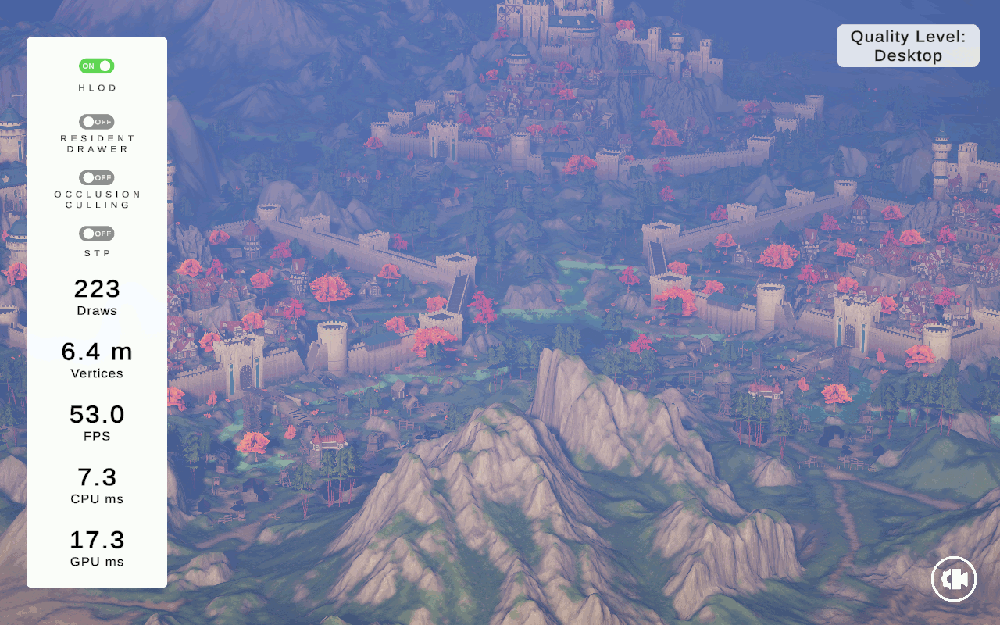

# About this repository
This is a fork of the original HLOD repo from 2019. This package is in no way intended to be production ready, let alone be considered an official Unity package. 
It is intended as a potential starting point/reference for users who wish to implement a custom HLOD system in their projects.
Treat it with the same skepticism as you would any sample snippet found on a barely maintained docs page.

While I've tried to address version compatiblity, add support for Scriptable Render Pipelines and fix various issues, many other issues (new and old) remain.

# HLOD system
The idea of a Hierarchical Level Of Detail system is to improve performance by simplifying the scene hierarchy as the distance from the camera increases.
By combining all of the static objects in a scene, and dividing the resulting mesh using a quadtree or octree, we can replace many objects without (very) noticeable quality loss.
* Improves rendering performance by reducing the number of draw calls.

This HLOD system includes an interface for a swappable batcher. The batcher is responsible for combining objects to build the HLOD tree structure meshes. The behavior of the used batcher can further affect performance.
* The *Material Preserving Batcher* will produce HLOD meshes with many submeshes as it preserves all of the original object's materials. The performance improvements come from its ability to collapse draw calls of objects using the same materials.
* The *Simple Batcher* will crudely atlas materials together, so that each resulting HLOD tree node mesh uses only 1 draw call. Additionally the single material reduces the texture memory/cache pressure for many scenarios, as some of the original individual textures may not be needed up close and can be replaced with the atlases at a distance.

Additonally the HLOD system contains an interface for a swappable Level-Of-Detail generator.
* Improves rendering performance by reducing the geometric complexity of the HLOD meshes.
* The *Unity Mesh Simplifier* is a crude geometry decimator. It reduces geometry until it reaches a certain fraction of the original geometry and lies within a certain min-max range.

A note on HLOD quality:
(H)LOD visual quality should always be evaluated at the distance they are intended to render at, using the project's intended rendering setup.
Artifacts in the HLOD generation such as texture coordinate stretching or missing polygons can be non-issues in the end due to their actual size on screen and limited contribution to the final pixel color due to effects like fog, lighting and post-processing.
Of course, more precise generation will allow using HLODs of the same cost (geometric and texture complexity) at distances closer to the camera, offering better performance gains. 

[Specification Document][specDoc]

| Render image  | Show draw calls | Show draw calls of HLOD |
| --- | --- | --- |
|  |   | |

Comparison between HLOD System On/Off.

Captured using a release build of the [demo project][demoProject] on a Steam Deck (LCD).
Uses the Simple Batcher to combine objects and relies on standard Unity LOD groups for the geometry simplification.

||DrawCalls|Verts|FPS|CPU ms|GPU ms|
|---|---|---|---|---|---|
|HLOD Off|5248|13.4M|36.5|13.2|16.8|
|HLOD On|223|6.4M|53.0|7.3|17.3|
|Ratio|4.25%|47.76%|145.21%|55.30%|102.98%|

## Latest Version: v0.0.3
* Simple Batcher: Added a setting (default true) that enables Alpha Clipping on HLOD materials if any of the source materials use transparency.
* Shadow proxies are now ignored when gathering MeshRenderers. Fixes these showing up in the generated HLOD meshes as untextured chunks of geometry that Z-fight.
* Added an HLOD menu bar with buttons to regenerate or destroy all HLODs in the scene.

### Issues:
There's lots of known and unknown issues, keep in mind that this is not intended to be a remotely production ready solution.
If you intend to use this for your project, you know also own all of the issues that come with it:

* Simple Batcher doesn't handle tiling texture coordinates well, resulting in warping as they'll be clamped to the atlas UV space assigned to them.
* The new Material Mapping UX is a *little* messy.
* Per-HLOD shader overrides are currently untested and unlikely to work.
* The HLOD LOD distance set up automatically at generation time is usually too conservative, preserving visual quality but without offering any performance gains.
* The HLOD LOD distance is also hard to reason about when tweaking manually, as it depends on the quality and other settings.
* The HLOD Component contains a lot of data that ends up in the scene file. This can make small changes result in large commits when using a version control system.
* The HLOD Data asset gets rather large, no effort has been made yet to optimize this.
* Addressables haven't been tested post-U6 upgrade (v0.0.3)

## How to use
Please refer to this document:[User Guide][userGuide]

Also, you can check out this version of the [Fantasy Kingdom][demoProject] demo project that integrates HLOD into the 3D game kit.

## Prerequisites
### Unity
```
Unity Version: 6000.0.35f1
```
### How To Install
Using the Package Manager's install using git URL function, add the following URL:
```
https://github.com/NicoLeyman/HLODSystem.git?path=/com.unity.hlod
```
The following URL adds the additional package for Addressables support:
```
https://github.com/NicoLeyman/HLODSystem.git?path=/com.unity.hlod.addressable
```

### License
Copyright (c) 2025 Unity Technologies ApS
Licensed under the Unity Companion License for Unity-dependent projects see [Unity Companion License][license].
Unless expressly provided otherwise, the Software under this license is made available strictly on an **“AS IS”** BASIS WITHOUT WARRANTY OF ANY KIND, EXPRESS OR IMPLIED. Please review the license for details on these and other terms and conditions.

[license]: <https://unity3d.com/legal/licenses/Unity_Companion_License>
[demoProject]: <https://github.com/Unity-Technologies/HLODSystemDemo>
[specDoc]: <https://docs.google.com/document/d/1OPYDNpwGFpkBorZ3GCpL9Z4ck-6qRRD1tzelUQ0UvFc>
[userGuide]: <https://docs.google.com/document/d/1jZ9dforSSUTokTmprunayq7d3LUTv2aQK63IbtS-QzU>
